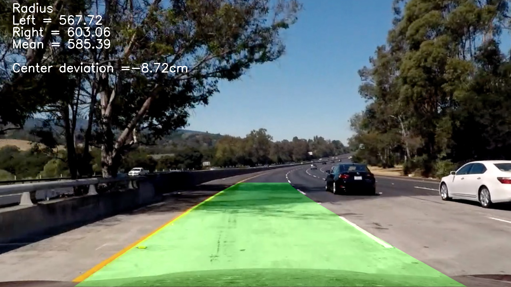

# **Advanced Lane Finding Project** 

Overview of relevant files
---
### CarND-Advanced-Lane-Lines.ipynb --- Jupyter notebook with code and comment describing the project steps
### Folder output_images --- partial result images of jupyter notebook
#### projct_output.mp4 --- Project result on video
#### undistorted_chessboard.png --- undistorted chessboard after calibration
#### undistorted_sample.png --- undisorted sample image
#### binary_threshold.png --- threshold image of both color channel threshold and gradient threshold
#### warped.png --- top view image after transformation
#### line_pixels_and_fit.png --- pixel candidates being part of a line and the corresponding second order polynomial fit
#### result_layered_lane_boundaries.png --- layered result of image processing chain to original image

### CarND-Advanced-Lane-Lines5 --- Writeup

